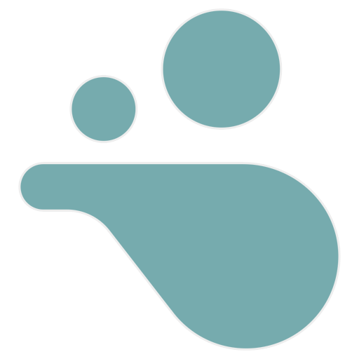

<h1 align="center">
  <picture></picture>
   
  img
</h1>
<h3 align="center">
  
  
  
</h3>

Img strives for a feature set tailored to tech-savvy individuals who don't need a full photo editing suite. The goal is to remove bloat but maintain the <i>best</i> version of modern features. Img takes inspiration from all over to provide a modern UI with efficient functionality.

**Img is currently being redone in the egui branch**
